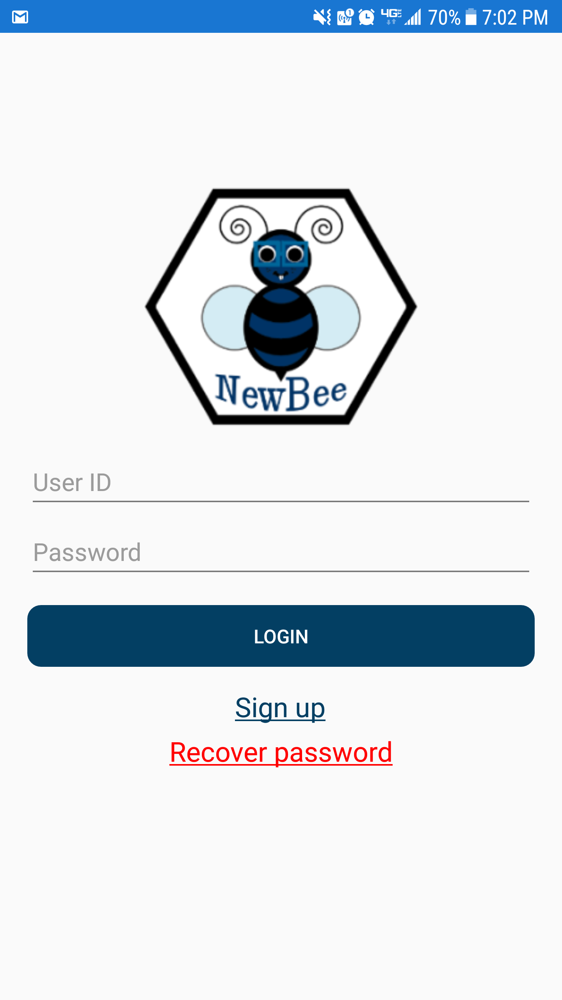
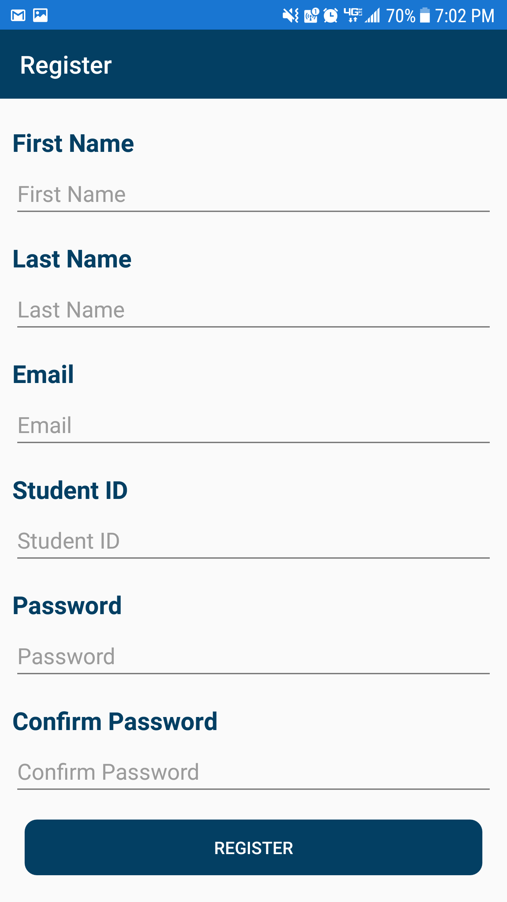
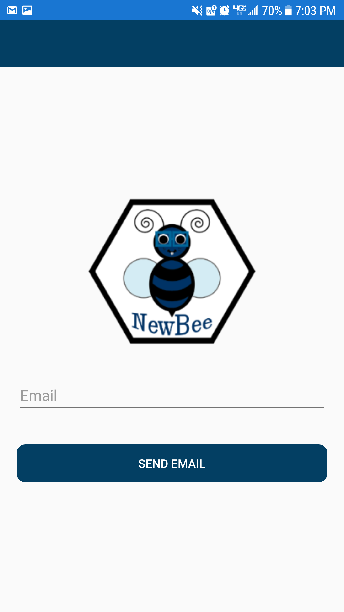
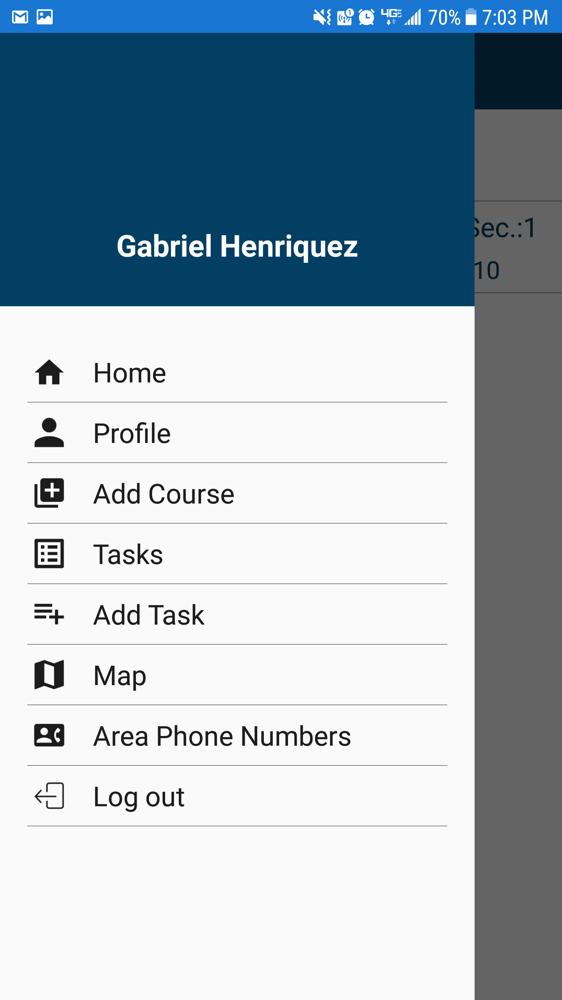
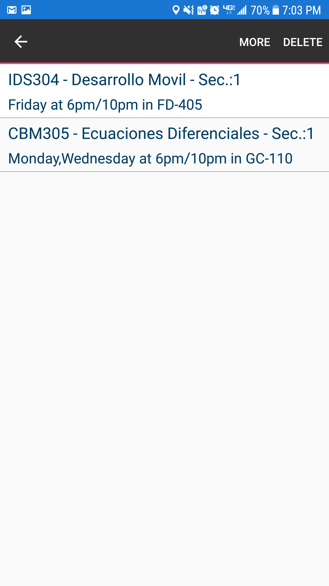
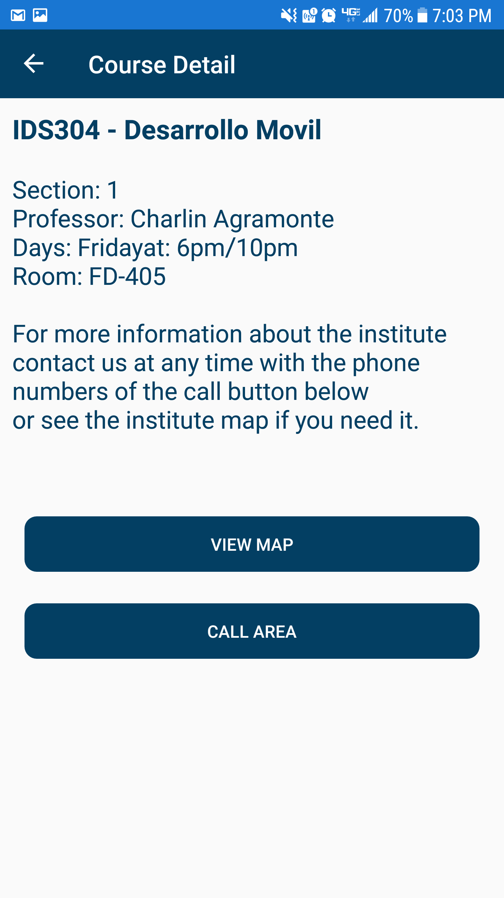
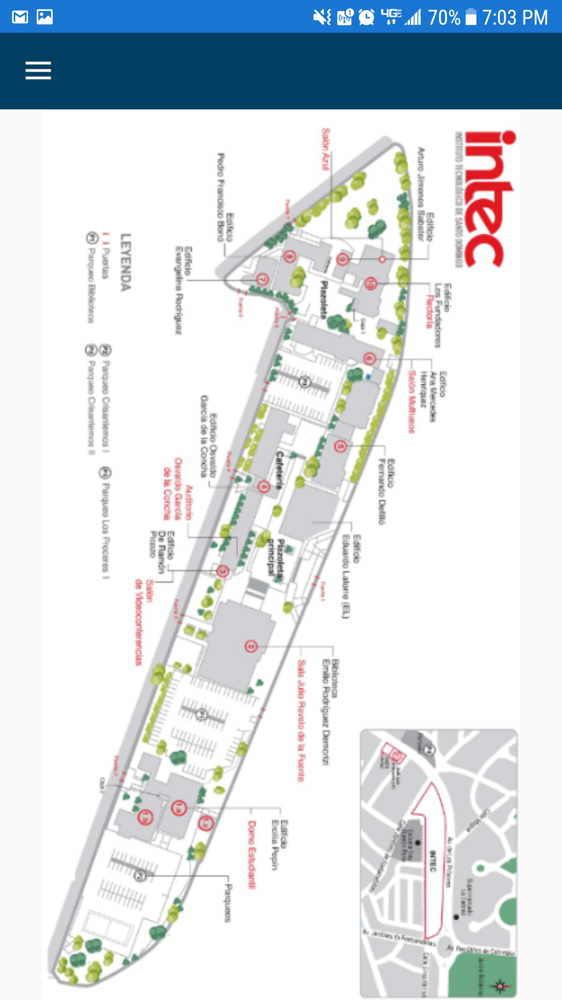
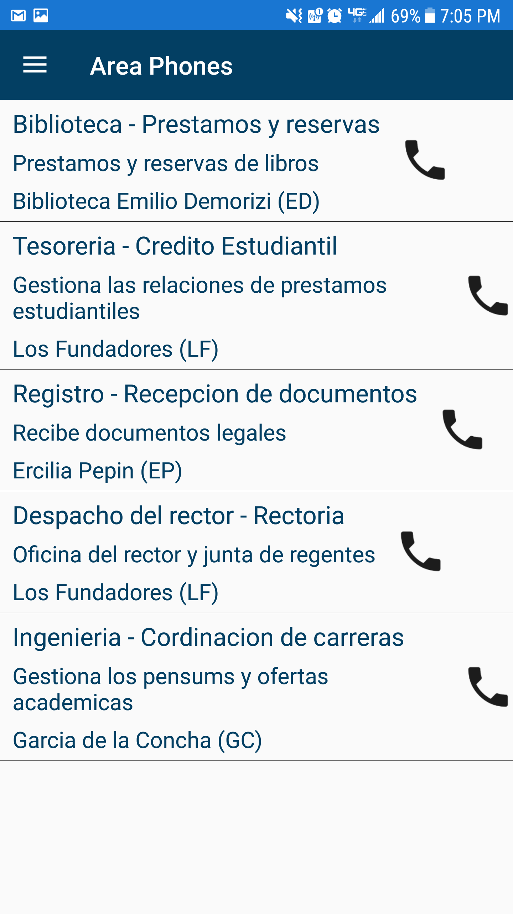
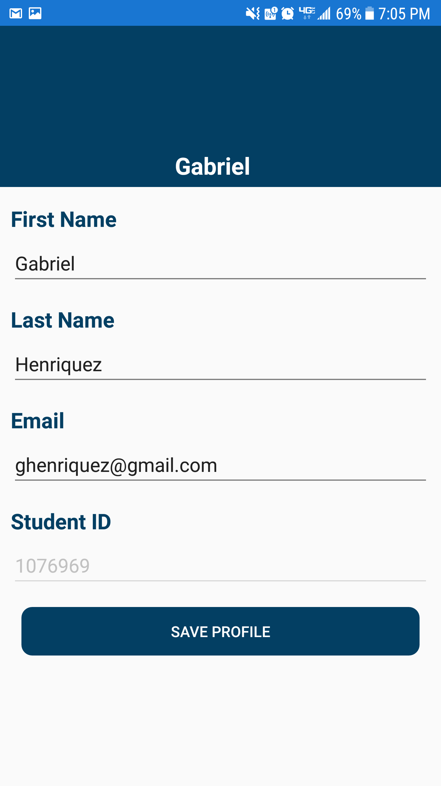

# NewBee
## XamgirlFinalProject
This is a project for the Xamarin Forms course with Xamgirl.

The NewBee app is for new students of INTEC, it counts with a Page for the current courses he is taking and the respective schedule. It also have a Detail page for the courses with all the information you need and that page have two buttons one of them can take you to a map of the institute and the other one takes you to a directory of phones of the diferent areas inside the institute (and you can even speed dial :D).

## LoginPage
This is the login page with two entrys (ID and Password) for Sign in and two clickable label one fore RegistrePage and the other one for the ForgottenPasswordPage.

### Register and Forgotten Password
A register page to create new accounts and forgotten password page to send an email to restablish your password.

## HomePage
The home page with a list of the current courses of the student, the courses are in a list view, if you press it yo have the option to delete the course and to navigate to the course detail page. And the hamburguer menu for the other pages that you can see below.

## Course Detail
The course detail page give all the information aboute the course you selected.

## Map Page
This is a page with the map of INTEC

## Area Phones Page
The area phone page, that contain all the phones you need if you want more information.

## Profile
Basic profile page.

